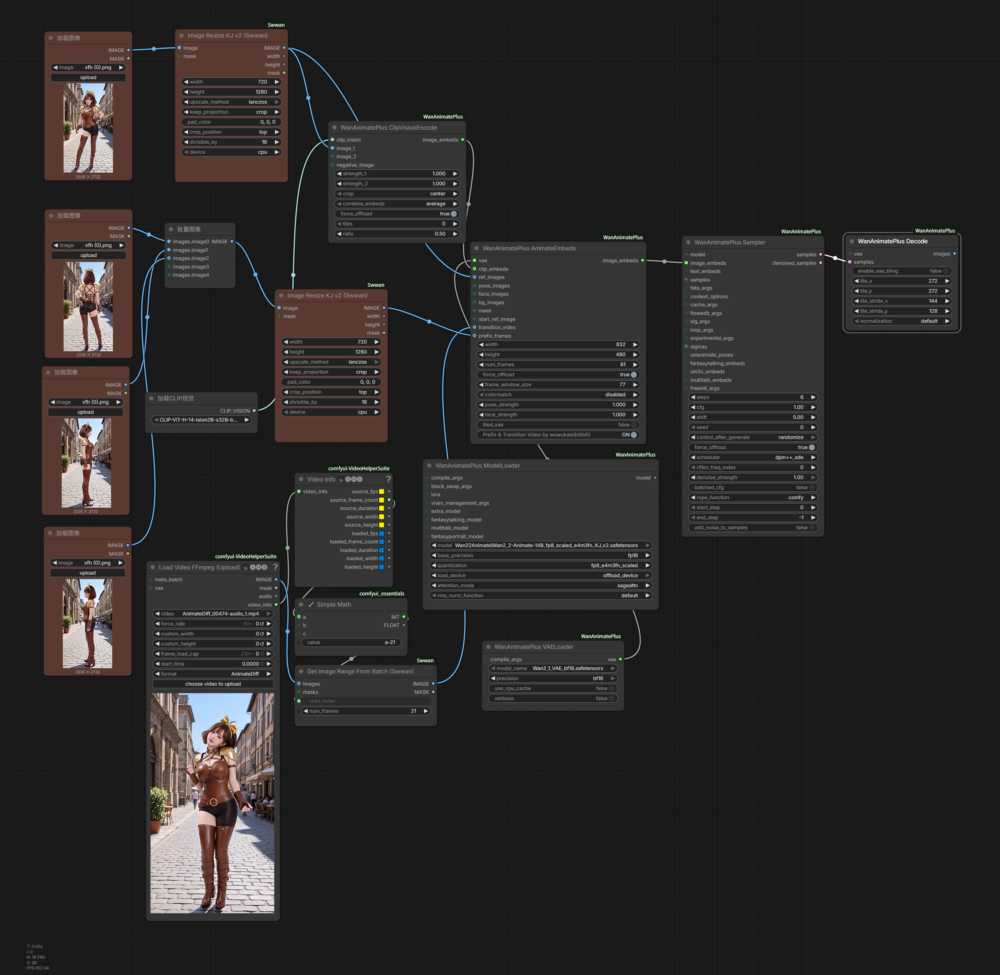

# ComfyUI-WanAnimatePlus

[English](./README.md) | [中文](./README_ZH.md)

Multi-reference image injection and seamless video connection for ComfyUI's WanAnimate pipeline.

## Overview

`ComfyUI-WanAnimatePlus` adds two core inputs to the original WanVideoWrapper's WanAnimate workflow:

- **prefix_frames**: allows passing 1–5 additional reference images for multi-reference guided generation
- **transition_video**: allows passing the last 21 frames of the previous video segment for seamless video connection

When used together, canvas layout and frame offsets are automatically coordinated without conflicts.

Use cases:

- Multi-shot video sequence generation
- Video continuation / extension
- Motion transfer with multi-reference control

## Demo

### prefix_frames & transition_video usage



### prefix_frames demo

[](https://github.com/user-attachments/assets/6df01023-5daa-42ab-9817-27a3b49bd6af)

### transition_video demo

[](https://github.com/user-attachments/assets/4c6d2d29-dc21-406c-8ae9-5201d4cc416b)

## Features

### prefix_frames (Multi-Reference Injection)

Allows 1–5 additional reference images. Internally expands the canvas pixel space and encodes reference images across the front frames, with automatic frame offset coordination for control signals (pose / face).

- Supports 1–5 reference images (truncated if exceeding 5)
- Auto-resizes reference images to target resolution
- Automatically aligns frame offsets for pose / face / bg / mask signals

### transition_video (Seamless Video Connection)

Allows passing the last 21 frames of the previous video segment. Writes these pixel frames directly into the front of the generation canvas, with sampled+reversed padding for control signal offsets.

- Non-looping: embeds directly into canvas; Looping: handled via context window mechanism
- Automatically coordinates with prefix when both are used

## Installation

Place this repository into ComfyUI's `custom_nodes` directory:

```bash
cd ComfyUI/custom_nodes
git clone https://github.com/wuwukaka/ComfyUI-WanAnimatePlus.git
```

Restart ComfyUI after installation.

> **Important**: To use `prefix_frames` and `transition_video`, you **must** replace the full workflow chain with WanAnimatePlus nodes. Mixing WanAnimatePlus nodes with original WanVideoWrapper nodes in the same workflow will result in degraded output.

## Quick Start

1. Start ComfyUI and confirm the WanAnimatePlus nodes appear under the `WanAnimatePlus` category
2. **Replace the entire workflow chain** with WanAnimatePlus counterparts: `ModelLoader`, `VAELoader`, `ContextOptions`, `AnimateEmbeds`, `Sampler`, `Decode`, and supporting nodes
3. Do **not** mix original WanVideoWrapper nodes in the same workflow
4. Connect `prefix_frames` and/or `transition_video` inputs as needed
5. Example workflows are available in the `example_workflows/` directory

## Nodes

WanAnimatePlus exposes a complete workflow chain to avoid cross-package object mixing with the original WanVideoWrapper nodes.

Core nodes:

- `WanAnimatePlus ModelLoader`
- `WanAnimatePlus VAELoader`
- `WanAnimatePlus TextEncodeCached`
- `WanAnimatePlus ClipVisionEncode`
- `WanAnimatePlus ContextOptions`
- `WanAnimatePlus AnimateEmbeds`
- `WanAnimatePlus Sampler` / `WanAnimatePlus Samplerv2`
- `WanAnimatePlus Scheduler` / `WanAnimatePlus Schedulerv2`
- `WanAnimatePlus Decode` / `WanAnimatePlus Encode`
- `WanAnimatePlus LoraSelectMulti` / `WanAnimatePlus SetLoRAs`
- `WanAnimatePlus BlockSwap` / `WanAnimatePlus SetBlockSwap`
- `WanAnimatePlus TorchCompileSettings`
- `WanAnimatePlus Uni3C ControlnetLoader` / `WanAnimatePlus Uni3C Embeds`

### WanAnimatePlus AnimateEmbeds

Core node, replaces the original `WanVideoAnimateEmbeds`.

**New inputs:**

| Input | Description |
|------|------|
| `prefix_frames` | 1–5 additional reference images for multi-reference guided generation |
| `transition_video` | Last 21 frames of the previous video segment for seamless video connection |

Other inputs are identical to the original WanVideoAnimateEmbeds: `vae`, `width`, `height`, `num_frames`, `ref_images`, `pose_images`, `face_images`, `bg_images`, `mask`, `start_ref_image`, `clip_embeds`, etc.

## Project Structure

```text
ComfyUI-WanAnimatePlus/
├─ wanvideo/                 # WanVideo core model code
├─ nodes.py                  # Core WanAnimatePlus embeds / encode / decode nodes
├─ nodes_sampler.py          # Core WanAnimatePlus sampler / scheduler nodes
├─ nodes_model_loading.py    # Core WanAnimatePlus model / VAE / LoRA / block swap nodes
├─ context_windows/          # Context-window scheduling
├─ cache_methods/            # Cache acceleration
├─ utils.py                  # Shared utilities
├─ docs/
│  └─ images/                # Documentation images
├─ example_workflows/        # Example workflows
├─ __init__.py               # Node registration entry point
├─ pyproject.toml
├─ requirements.txt
└─ LICENSE
```

## FAQ

### 1. Nodes not showing after installation

- Verify the repo path is `ComfyUI/custom_nodes/ComfyUI-WanAnimatePlus`
- Ensure the original `ComfyUI-WanVideoWrapper` is also installed
- Restart ComfyUI and search for `WanAnimatePlus` in the node list

### 2. Conflicts with original nodes?

No. All node names use the `WanAnimatePlus` prefix, completely avoiding conflicts with the original `WanVideo` prefixed nodes. Both can be installed simultaneously.

### 3. How many images for prefix_frames?

3 is recommended. Up to 5 are accepted (excess is truncated). The node works with fewer than 3 as well, but the coverage range will be smaller.

### 4. How many frames for transition_video?

Input is automatically cropped to 21 frames (padded with the first frame if insufficient).

## Acknowledgments

Modified from [kijai/ComfyUI-WanVideoWrapper](https://github.com/kijai/ComfyUI-WanVideoWrapper). Deep respect to the original author for their tremendous contributions to the WanVideo ecosystem.

## Contact

- Bilibili: [@wuwukasi](https://space.bilibili.com/670281046)
- Email: wuwukawayi@gmail.com

## Sponsorship

If you find this project helpful, consider buying me a coffee!

<p align="center"></p>

## License

Based on the original project, released under **Apache License, Version 2.0**. Modified files include copyright attribution and modification notices in their headers.
