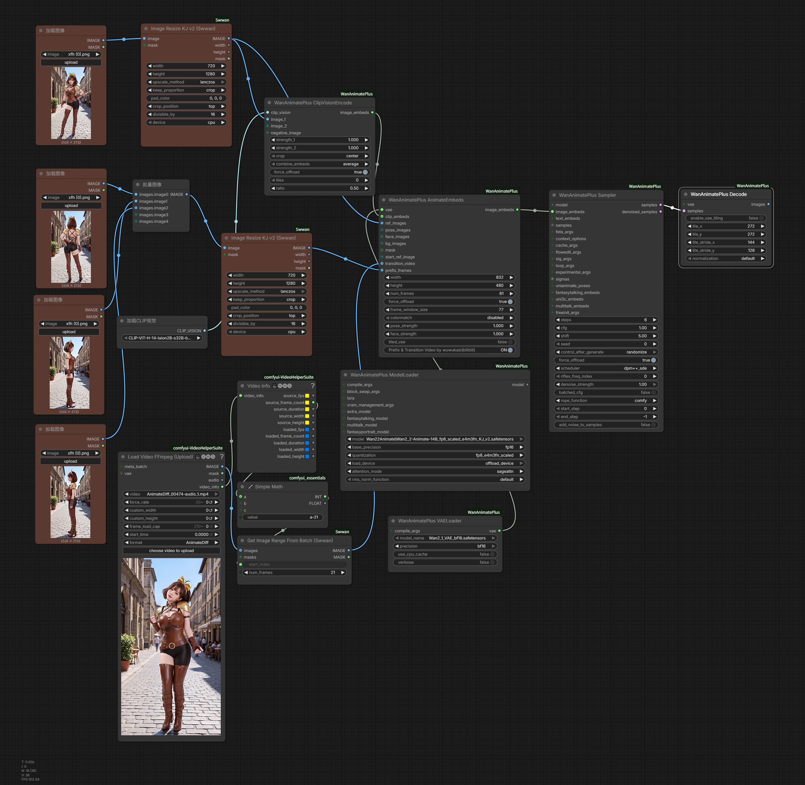

# ComfyUI-WanAnimatePlus

[English](./README.md) | [中文](./README_ZH.md)

为 ComfyUI 的 WanAnimate 视频生成管线提供多参考图注入与无缝视频衔接能力。

## 项目简介

`ComfyUI-WanAnimatePlus` 在 WanVideo 工作流上新增了四大功能：

### prefix_frames 与 transition_video

- **prefix_frames**：允许用户传入 1~5 张额外参考图，实现多参考图引导生成
- **transition_video**：允许用户传入上一段视频的最后 21 帧，实现无缝视频衔接

同时使用时，两者自动协调画布布局和帧偏移，互不干扰。

### Bernini

支持 Bernini 模型，允许用户传入源视频、参考视频或参考图像作为生成条件，支持 v2v、rv2v、r2v 和 t2v 任务。

适用场景：

- 多镜头视频串联生成
- 视频续写 / 延长
- 需要多参考图控制的动作迁移流程
- 视频编辑（源视频 + 参考图）
- 参考图生视频

### SCAIL-2 Embeds

新增基于 WanAnimatePlus 采样器适配的 `WanAnimatePlus SCAIL_2 Embeds` 节点，用于准备 SCAIL-2 的参考图、pose、colored pose mask、reference mask、prefix/transition 硬冻结 latent，以及与 prefix 对齐的 colored mask。

## 效果展示

### prefix_frames 与 transition_video 使用示例



### prefix_frames 效果演示

[](https://github.com/user-attachments/assets/6df01023-5daa-42ab-9817-27a3b49bd6af)

### transition_video 效果演示

[](https://github.com/user-attachments/assets/4c6d2d29-dc21-406c-8ae9-5201d4cc416b)

## 功能特性

### prefix_frames（多参考图注入）

允许用户传入 1~5 张额外参考图。内部通过扩展画布像素空间，将参考图按帧分布编码到生成视频前部，使控制信号（pose / face）自动完成帧偏移协调，从而实现多参考图引导生成。

- 支持 1~5 张参考图，超过 5 张自动截断
- 参考图自动缩放到目标分辨率
- pose / face / bg / mask 等控制信号的帧偏移自动对齐

### transition_video（无缝视频衔接）

允许用户传入上一段视频的最后 21 帧。内部将这段视频像素帧直接写入生成画布的前部位置，并通过采样+反向补齐控制信号偏移，使当前生成的视频与前置片段无缝衔接。

- 与 prefix 同时使用时自动协调画布布局，两者互不干扰

### Bernini

通过 VAE 编码将源视频、参考视频和/或参考图像作为生成条件注入。支持 v2v、rv2v、r2v 和 t2v 任务，任务类型根据接入的输入自动推断。

- 参考图像保持原始宽高比
- 兼容 context window

### SCAIL-2

通过 `WanAnimatePlus SCAIL_2 Embeds` 提供 SCAIL-2 ref / pose / mask 条件注入。

- 编码 `ref_image`、`pose_images`、`pose_image_mask`、`prefix_frames`、`prefix_mask`、`bg_image` 和 `reference_image_mask`
- SCAIL-2 输入会在编码前对齐到 32 像素倍数
- 支持 animation / replacement 两种模式
- 支持单帧 prefix 参考编码和可选的 `transition_video` 硬冻结条件
- 默认情况下，`prefix_frames` 会作为全分辨率 reference latents 编码，不扩展输出画布；关闭 `single_frame_prefix_encoding` 后才使用 legacy 37 前置像素帧 prefix 布局
- 单帧 prefix 模式下，`prefix_mask` 走与 `reference_image_mask` 相同的 reference-mask 路径
- 支持 context window；非首窗口可以看到 prepend 的 prefix/transition 上下文，但这些 prepend 预测不会进入 overlap 融合

## 安装方式

将本仓库放入 ComfyUI 的 `custom_nodes` 目录：

```bash
cd ComfyUI/custom_nodes
git clone https://github.com/wuwukaka/ComfyUI-WanAnimatePlus.git
```

安装完成后重启 ComfyUI。

> **重要**：要使用 `prefix_frames`、`transition_video`、`Bernini` 或 `SCAIL_2 Embeds`，**必须**全链路替换为 WanAnimatePlus 版本节点。在同一个工作流中混用 WanAnimatePlus 节点和原版 WanVideoWrapper 节点会导致输出异常。

## 快速开始

1. 启动 ComfyUI，确认 `WanAnimatePlus` 分类下能看到完整节点链路
2. **将整个工作流链路替换**为 WanAnimatePlus 版本：`ModelLoader`、`VAELoader`、`ContextOptions`、`AnimateEmbeds`、`Sampler`、`Decode` 及配套节点
3. **不要**在同一个工作流中混用原版 WanVideoWrapper 节点
4. 根据需要接入 `prefix_frames` 或 `transition_video` 输入
5. 示例工作流见 `example_workflows/` 目录

## 节点说明

WanAnimatePlus 暴露了一套完整工作流链路，用于避免与原版 WanVideoWrapper 节点跨包混用。

核心节点：

- `WanAnimatePlus ModelLoader`
- `WanAnimatePlus VAELoader`
- `WanAnimatePlus TextEncodeCached`
- `WanAnimatePlus ClipVisionEncode`
- `WanAnimatePlus ContextOptions`
- `WanAnimatePlus AnimateEmbeds`
- `WanAnimatePlus Sampler` / `WanAnimatePlus Samplerv2`
- `WanAnimatePlus Scheduler` / `WanAnimatePlus Schedulerv2`
- `WanAnimatePlus Decode` / `WanAnimatePlus Encode`
- `WanAnimatePlus LoraSelect` / `WanAnimatePlus LoraSelectMulti` / `WanAnimatePlus SetLoRAs`
- `WanAnimatePlus BlockSwap` / `WanAnimatePlus SetBlockSwap`
- `WanAnimatePlus TorchCompileSettings`
- `WanAnimatePlus SamplerExtraArgs`
- `WanAnimatePlus Uni3C ControlnetLoader` / `WanAnimatePlus Uni3C Embeds`
- `WanAnimatePlus Bernini`
- `WanAnimatePlus SCAIL_2 Embeds`

### WanAnimatePlus AnimateEmbeds

核心节点，替代原版 `WanVideoAnimateEmbeds`。

**新增输入：**

| 输入 | 说明 |
|------|------|
| `prefix_frames` | 允许用户传入 1~5 张额外参考图，实现多参考图引导生成 |
| `transition_video` | 允许用户传入上一段视频的最后 21 帧，实现无缝视频衔接 |

其他输入与原版 WanVideoAnimateEmbeds 一致：`vae`、`width`、`height`、`num_frames`、`ref_images`、`pose_images`、`face_images`、`bg_images`、`mask`、`start_ref_image`、`clip_embeds` 等。

### WanAnimatePlus Bernini

为 Bernini 模型生成条件 latents，支持源视频、参考视频和参考图像。

**输入：**

| 输入 | 说明 |
|------|------|
| `vae` | 用于编码的 VAE 模型 |
| `width` / `height` / `num_frames` | 输出尺寸 |
| `source_video` | 待编辑/重建的源视频（v2v/rv2v），缩放到 width/height |
| `reference_video` | 要合成到源视频中的动态内容（视频插入），保持原始宽高比 |
| `reference_images` | 作为上下文 token 注入的参考图像（r2v/rv2v），保持原始宽高比 |
| `ref_max_size` | 参考媒体长边最大尺寸（默认 848） |
| `force_offload` | 编码后将 VAE 卸载以节省显存 |
| `tiled_vae` | 使用分块 VAE 编码以节省显存 |

任务类型（v2v、rv2v、r2v、t2v）根据连接的输入自动推断。

### WanAnimatePlus SCAIL_2 Embeds

为 WanAnimatePlus 采样生成 SCAIL-2 条件。请配合包含 pose / mask stream 的 SCAIL-2 checkpoint 使用。

**输入：**

| 输入 | 说明 |
|------|------|
| `vae` | 用于编码的 VAE |
| `width` / `height` / `num_frames` | 目标尺寸；宽高会对齐到 32 像素倍数 |
| `ref_image` | SCAIL-2 参考图条件 |
| `bg_image` | animation 模式下可选的单张背景图；单帧模式下会额外编码为 background reference latent，legacy canvas-prefix 模式下追加到用户 `prefix_frames` 之后；replacement 模式下忽略 |
| `pose_images` | 驱动 pose 视频/图像，按半分辨率编码 |
| `pose_image_mask` | colored per-identity pose mask 序列 |
| `prefix_mask` | 可选，与 `prefix_frames` 对齐的 colored mask 图像；在单帧 prefix 模式下走 reference-mask 路径，在 legacy canvas-prefix 模式下按 `1+4+4...` 展开并写入 prefix 像素 mask 帧 |
| `reference_image_mask` | colored reference mask 图像 |
| `replacement_mode` | 启用 SCAIL-2 replacement-mode RoPE 和 reference-mask 合成 |
| `preserve_main_ref_background` | 仅 animation 模式使用；开启时保留主参考图背景，关闭时使用 `reference_image_mask` 做黑底 alpha crop。replacement 模式下忽略 |
| `single_frame_prefix_encoding` | 将 `prefix_frames` 编码为独立的全分辨率 reference latents，而不是扩展画布；默认开启 |
| `prefix_frames` | 可选 prefix 图像。默认单帧模式下会成为 reference-stream latents；关闭单帧模式后才硬冻结到前置画布 |
| `transition_video` | 可选，硬冻结在 latent 序列前部的 transition 帧 |
| `clip_embeds` | 可选，来自 `WanAnimatePlus ClipVisionEncode` 的 CLIP vision 特征 |
| `force_offload` / `tiled_vae` | VAE 编码相关显存控制 |

短视频生成时 context window 可选；长视频或低显存场景建议使用 context window。context-window 模式下，单帧 prefix reference 会通过 SCAIL-2 reference stream 保持可见；legacy canvas prefix 和 transition latents 会 prepend 给模型作为上下文，并在 overlap 融合前移除这些 prepend 预测。

SCAIL-2 默认的 `single_frame_prefix_encoding` 模式不会因为 `prefix_frames` 扩展或裁剪输出。如果连接 `transition_video`，前置画布会扩展 21 个像素帧，解码后裁掉这 21 帧。关闭 `single_frame_prefix_encoding` 后，`prefix_frames` 使用 legacy 37 前置像素帧画布；同时连接 `transition_video` 时，transition 帧放在第 17-36 帧。

animation 模式下连接 `bg_image` 时，节点会为该背景图内部添加白色 mask。用户提供的 `prefix_frames` 和 `prefix_mask` 各自最多保留四张，让背景图占用剩余的 reference/prefix 容量。replacement 模式下 `bg_image` 会被忽略。

## 项目结构

```text
ComfyUI-WanAnimatePlus/
├─ wanvideo/                 # WanVideo 核心模型代码
├─ nodes.py                  # WanAnimatePlus embeds / encode / decode 核心节点
├─ nodes_sampler.py          # WanAnimatePlus sampler / scheduler 核心节点
├─ nodes_model_loading.py    # WanAnimatePlus model / VAE / LoRA / block swap 节点
├─ context_windows/          # Context window 调度
├─ cache_methods/            # 缓存加速方法
├─ utils.py                  # 公共工具函数
├─ docs/
│  └─ images/                # 文档图片
├─ example_workflows/        # 示例工作流
├─ __init__.py               # 节点注册入口
├─ pyproject.toml
├─ requirements.txt
└─ LICENSE
```

## 常见问题（FAQ）

### 1. 安装后看不到节点

- 确认仓库路径在 `ComfyUI/custom_nodes/ComfyUI-WanAnimatePlus`
- 确认已同时安装原版 `ComfyUI-WanVideoWrapper`
- 重启 ComfyUI 后在节点列表中搜索 `WanAnimatePlus`

### 2. 与原版节点冲突？

不会。本插件所有节点名使用 `WanAnimatePlus` 前缀，与原版 `WanVideo` 前缀完全不冲突，两者可同时安装。

### 3. prefix_frames 输入几张图合适？

推荐 3 张。第一张使用 1 帧，后续每张各展开 4 帧，即 `1+4+4...`，最多 5 张、17 帧。超过 5 张会被自动截断。如果输入不足 3 张，节点也会正常工作，但覆盖范围会相应减小。

### 4. transition_video 需要多少帧？

会自动裁剪到 21 帧（不足则用首帧补齐）。21 像素帧对应约 6 个 latent 帧的过渡空间。

## 致谢

本项目修改自 [kijai/ComfyUI-WanVideoWrapper](https://github.com/kijai/ComfyUI-WanVideoWrapper)，致敬原作者对 WanVideo 生态的巨大贡献。

感谢 [checknickname/ComfyUI-Scail2-Sampler-Helper](https://github.com/checknickname/ComfyUI-Scail2-Sampler-Helper) 提供 SCAIL-2 two-phase sampling 思路，也感谢 [user2318/ComfyUI-CustomNodeKit](https://github.com/user2318/ComfyUI-CustomNodeKit/) 提供实现参考。详细归属说明见 [NOTICE](NOTICE)。

## 联系方式

- Bilibili: [@wuwukasi](https://space.bilibili.com/670281046)
- 邮箱: wuwukawayi@gmail.com

## 赞助

如果觉得本项目对你有帮助，欢迎赞助支持！有了您的支持，我才有动力继续改进和维护这个项目。

每一份支持都很重要，让我能投入更多时间进行开发和新增功能。感谢！

<p align="center">
  
  
</p>

## 许可证

本项目是基于 [kijai/ComfyUI-WanVideoWrapper](https://github.com/kijai/ComfyUI-WanVideoWrapper) 的独立维护 fork / 衍生项目，并按 **Apache License, Version 2.0** 协议发布。再次感谢 kijai 以及原项目贡献者的工作。

本项目中的 wuwukasi/wuwukaka 修改部分和新增源码表达 Copyright (c) 2026 wuwukasi/wuwukaka。归属范围、作者声明和修改说明要求见 [NOTICE](NOTICE)。
